# What's the Weather Like?

## Background
"What's the weather like as we approach the equator?"
Visualizing the weather of 500+ cities across the world of varying distance from the equator using Python, and the OpenWeatherMap API, to create a representative model of weather across world cities.

## Part I - WeatherPy

The first objective is to build a series of scatter plots to showcase the following relationships:

* Temperature (C) vs. Latitude

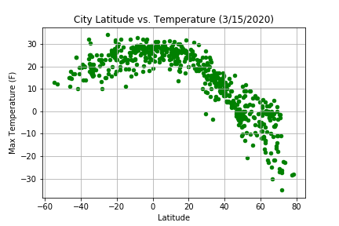

* Humidity (%) vs. Latitude

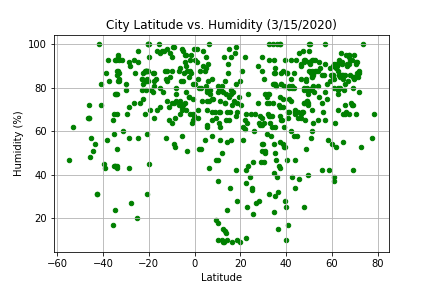

* Cloudiness (%) vs. Latitude

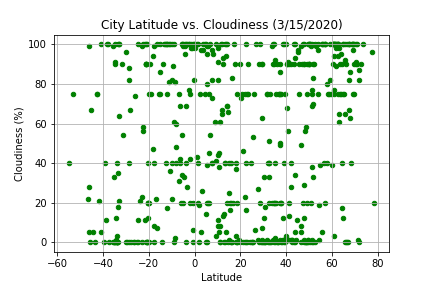

* Wind Speed (mph) vs. Latitude

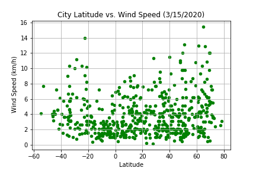

The next objective is to run linear regression on each relationship, only this time separating them into Northern Hemisphere (greater than or equal to 0 degrees latitude) and Southern Hemisphere (less than 0 degrees latitude):

* Northern Hemisphere - Temperature (C) vs. Latitude

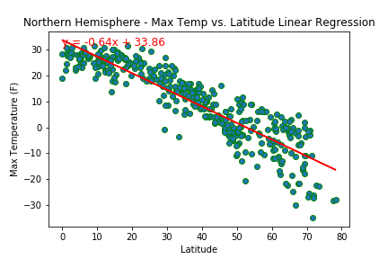

* Southern Hemisphere - Temperature (C) vs. Latitude

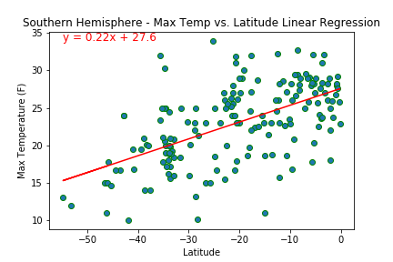

* Northern Hemisphere - Humidity (%) vs. Latitude

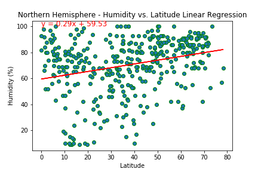

* Southern Hemisphere - Humidity (%) vs. Latitude

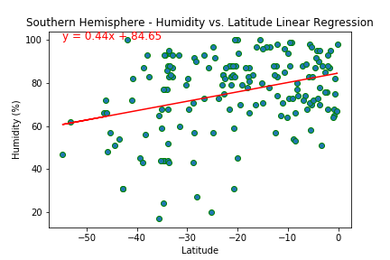

* Northern Hemisphere - Cloudiness (%) vs. Latitude

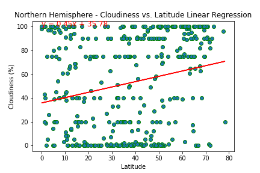

* Southern Hemisphere - Cloudiness (%) vs. Latitude

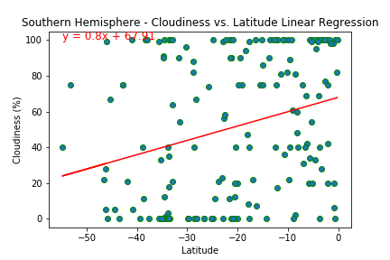

* Northern Hemisphere - Wind Speed (mph) vs. Latitude

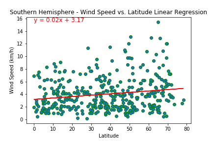

### Part II - VacationPy

Utilizing the weather data to plan future vacations.Jupyter-gmaps and the Google Places API are used to find cities from the WeatherPy notebook results that have the ideal weather for a vacation spot. Ideal weather conditions include:

  * A max temperature lower than 80(F) degrees but higher than 70(F).
  
  * Wind speed less than 10 mph.
  
  * Zero cloudiness.
  
Using Google Places API,the first hotel for each city located within 5000 meters of the coordinates is found and plotted on top of the humidity heatmap with each pin containing the Hotel Name, City, and Country.

  
  

### Conclusion

* Comparing maximum temperatures in the northern and southern hemispheres its clear that the temperatures increase as we move closer to the equator. Cities located near equator on the southern hemisphere have slightly lower temperatures as compared to northern hemisphere.

* There is a close correlation between humidity and cloudiness, both tend to increase moving towards the north and south poles.

* Wind speed tend to be higher closer to south pole as compared to north pole.

